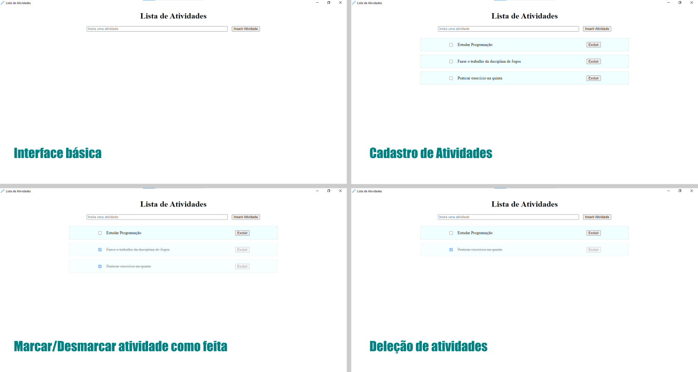

# Projeto de Lista de Atividades usando Electron

O Projeto consiste de uma aplicação desktop para cadastro de atividades. A interface contem um input de texto para o usuário escrever uma atividade e adiconar em uma lista local do programa. OBS: Toda vez que o programa é aberto a lista é zerada, não guardando nenhuma informação.

## Design do projeto

;

## Funcionalidades

A aplicação desktop contem as seguinte funcionalidade:

- [x] Cadastrar uma atividade clicando no botão ou apertando ENTER
- [x] Excluir uma atividade
- [x] Marcar e desmarcar como feita uma atividade
- [ ] Mostrar notificação quando tenta-se adicionar uma atividade vazia

## Ferramentas utilizadas

As seguintes ferramentas foram utilizadas:

### Node

Ambiente de execução de JavaScript disponível para várias plataformas, de código aberto e gratuita, que permite os programadores criar servidores, aplicações da Web, ferramentas de linha de comando e programas de automação de tarefas.

**Download e Instalação**: https://nodejs.org/pt

### Electron

Framework que te permite criar aplicações desktop multiplataforma (windows, linux e mac) com JavaScript, HTML e CSS.

**Instalação**:

```
npm install --save-dev electron
```

### Electron Reload

Pacote adicional do electron que permite fazer alterações no código e já atualizar a interface da aplicação sem precisar executar novamente.

**Instalação**:

```
npm install --save-dev electron-reload
```

> [!NOTE]
> Tanto a instalação do **electron** e **electron-reload** foram instaladas com a flag **--save-dev** para que sejam incluídos como dependência de desenvolvimento apenas, pois na geração do executável (build), elas não seram necessárias.

## Executar o projeto

Primeiramente, certificique-se de instalar as dependências:

```
npm install
```

Para executar, digite a segunte linha no diretório raiz do projeto

```
npm run dev
```

## Gerar o executável (Build)

Para gerar um executável, bastar seguir os seguintes passos abaixo. Eles seguem a documentação do electron: https://www.electronjs.org/pt/docs/latest/tutorial/tutorial-packaging

### Passo 1: Instalar as dependências para geração do build

```
npm install --save-dev @electron-forge/cli
npx electron-forge import
```

> [!NOTE]
> A primeira linha instala o pacote do electron-forge responsável pela geração do executável

> [!NOTE]
> A segunda linha atualiza o arquivo package.json importando alguns scripts necessários para a geração do executável

### Passo 2: Gerando o executável

```
npm run make
```

> [!NOTE]
> Após a execução desse script, uma pasta chamada **out** será criada contendo o executável da aplicação, assim como os arquivos necessários para a sua execução.

> [!NOTE]
> Alguns detalhes são **importantes** na hora de gerar o build:

> [!IMPORTANT]
> Não usar **caracteres especiais** como acentos, cedilha, ..., no caminho/diretórios da aplicação.

> [!IMPORTANT]
> Retirar as linhas de código do **electron-reload**, caso esteja usando.

> [!IMPORTANT]
> No arquivo package.json, atribuir valores para os seguintes atributos: **name**, **productName**, **description** e **author**.

> [!IMPORTANT]
> Necessária a instalação do **git** para desktop.
